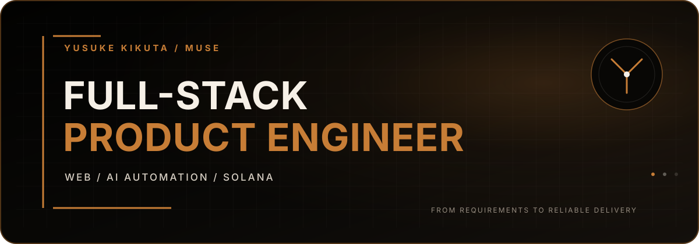

  
  

  

<h1 align="center">Yusuke Kikuta (Muse)</h1>

  <strong>TypeScript-first full-stack engineer turning ambiguous ideas into working products.</strong>

  <a href="https://yusuke-portfolio.yusukekikuta-05.workers.dev">Portfolio</a>
  &nbsp;·&nbsp;
  <a href="https://axs.pizza/">Axis</a>
  &nbsp;·&nbsp;
  <a href="https://zenn.dev/yusukekikuta">Zenn</a>
  &nbsp;·&nbsp;
  <a href="https://www.linkedin.com/in/yusukekikuta">LinkedIn</a>
  &nbsp;·&nbsp;
  <a href="https://x.com/muse_jp_sol">X</a>
  &nbsp;·&nbsp;
  <a href="mailto:yusukekikuta.05@gmail.com">Email</a>

> **Open to freelance engagements.** As of August 2026, I am available for approximately 15–20 hours per week, fully remote. For zero-to-one product development, PoCs, technical leadership, AI/RAG automation, or Solana integrations, contact me via [Email](mailto:yusukekikuta.05@gmail.com) or [LinkedIn](https://www.linkedin.com/in/yusukekikuta).

## Impact at a Glance

|  |  |
| :---: | :---: |
| **≈400** Axis Devnet users | **2,100+** User-created baskets |
| **400+** Lead acquisitions supported | **5 people** Product team |

Axis figures are Devnet results, acquired without paid advertising or user incentives.

## Profile

I build across frontend, backend, APIs, databases, AI automation, and Solana integrations, with TypeScript and React at the center of my work. My strength is translating business goals and user needs into priorities, architecture, implementation, reviews, and post-release improvements.

At [Axis](https://axs.pizza/), I work as Technical Founder / Full-stack Engineer, leading product delivery across a five-person team. I have owned major frontend and backend work, requirements alignment, pull request reviews, and release decisions. I also conduct technical meetings, requirements discussions, negotiations, and product pitches in English.

## What I Can Help With

| Area | Value I deliver |
| --- | --- |
| **Zero-to-one Product Development** | Turn ambiguous requirements into an MVP scope, technical direction, UI / API / database design, implementation, and release |
| **Full-stack Web** | Build from React / Next.js frontends through Hono / Cloudflare Workers APIs, databases, and operations |
| **AI / RAG & Automation** | Design and implement internal tools, AI agents, RAG workflows, and browser automation with OpenAI API and Selenium |
| **Solana / Web3** | Wallet connections, transaction construction and signing, SPL Token flows, on-chain state integration, DeFi UX, and program R&D / testing |
| **Technical Leadership** | Requirements and architecture reviews, pull request reviews, quality and priority decisions, releases, and cross-border technical coordination |

## Selected Work

### Axis — On-chain Basket DeFi Product

- **Role:** Technical Founder / Full-stack Engineer
- **Contribution:** Started Axis as an independent project and built the core frontend and backend of its initial Devnet PoC across the React / Vite SPA, Hono / Cloudflare Workers / D1 APIs and data layer, wallet connections, transaction construction, analytics, and operations; later led requirements alignment, reviews, and release decisions for a five-person team
- **Outcome:** Reached approximately 400 Devnet users and 2,100+ user-created baskets
- **Stack:** TypeScript, React, Vite, Tailwind CSS, Hono, Cloudflare Workers, D1, Drizzle ORM, Solana Web3.js
- **Evidence:** [Product](https://axs.pizza/) · [Repository](https://github.com/Axis-pizza/Axis_MVP) · [Dynamic OGP PR #117](https://github.com/Axis-pizza/Axis_MVP/pull/117) · [Edge cache PR #120](https://github.com/Axis-pizza/Axis_MVP/pull/120) · [Technical article](https://zenn.dev/yusukekikuta/articles/04904b02dcadfb)

### ctsDAO — Landing Page & Intake System

- **Role:** Full-stack Engineer
- **Contribution:** Built an editorial landing page, Zod-validated intake form, rate limiting, UTM / referral attribution, GA4 / PostHog analytics, admin JSON / CSV APIs, and a SQLite / PostgreSQL adapter
- **Outcome:** Unified interest capture, acquisition attribution, and admin exports into one operational path
- **Stack:** Next.js App Router, TypeScript, Tailwind CSS, Zod, SQLite, PostgreSQL, GA4, PostHog
- **Evidence:** [Repository](https://github.com/muse0509/ctsdao_lp) · [Implementation PR #3](https://github.com/muse0509/ctsdao_lp/pull/3)

### Axis AMM — Solana Batch Auction Research

- **Role:** Product Lead / Protocol R&D
- **Contribution:** Defined requirements, economic design, validation criteria, and security boundaries for a periodic batch auction designed to mitigate LVR, then coordinated implementation and testing with contract engineers
- **Outcome:** The public project benchmark reports an O(1) ClearBatch independent of order count at 38,120 CU median / 38,500 CU p95
- **Stack:** Rust, Pinocchio, Solana, LiteSVM / local validator, Jito, Switchboard
- **Evidence:** [Research repository](https://github.com/Axis-pizza/Axis_AMM) — research software / unaudited prototype

## Client Work & Product Support

- **AI sales automation:** Built a Python / OpenAI API / RAG / Selenium / AWS workflow spanning company research, message generation, contact-form submission, exception handling, and retries; contributed to 400+ acquired leads in production
- **AI / RAG internal application:** Implemented the React frontend and API integration for prompts, generated responses, source references, loading states, and error states
- **Web3 MVP mentoring:** At Fracton Ventures, supported multiple teams with requirements, MVP scoping, technology choices, and code reviews through Demo Day

Source code and detailed specifications are not public due to client confidentiality and contractual obligations. I can share more context within the permitted scope during an interview.

## Core Stack

| Area | Technologies | Applied to |
| --- | --- | --- |
| **Frontend** | TypeScript, JavaScript, React, Next.js, Vite, Tailwind CSS | SPAs, business applications, async UX, responsive UI, PWAs |
| **Backend / Data** | Hono, Node.js, REST APIs, Cloudflare Workers, D1 / SQLite, PostgreSQL, Drizzle ORM, SQL | API and database design, migrations, scheduled jobs, data indexing, operations |
| **AI / Automation** | Python, OpenAI API, RAG, Selenium | AI agents, content generation, retrieval, browser automation, retries, quality improvement |
| **Solana / Web3** | Solana Web3.js, SPL Token, Wallet Adapter, Jupiter, Anchor Client, Rust / Pinocchio / LiteSVM | Wallet and transaction flows, DeFi UX, program R&D and test design / coordination |
| **Cloud / Delivery** | Cloudflare, AWS, Git, GitHub, CI, Figma | Serverless operations, logging and incident fixes, reviews, releases, requirements alignment |

## How I Work

1. **Align goals and constraints** — clarify the user problem, timeline, risks, and success criteria.
2. **Validate a vertical slice early** — connect UI, API, data, and external integrations into a working path.
3. **Verify with execution evidence** — use types, tests, logs, on-chain state, and balance deltas instead of trusting external services or generated output blindly.
4. **Make decisions legible and ship** — document options and trade-offs, review changes, use CI, and continue through post-release improvements.

## Writing & Recognition

- Zenn: [Building a blockchain application with React / Vite and Hono (Japanese)](https://zenn.dev/yusukekikuta/articles/04904b02dcadfb)
- Colosseum Frontier Hackathon — Superteam Japan Track Winner ($4,000)
- Sol Hack3rs Global Hackathon — Slash Vision Labs Award / Audience Award ($1,000)
- Breakout Hackathon — Zee Prime Capital Sidetrack 1st Place ($25,000, selected from 158 teams)

## Contact

I welcome freelance, PoC, technical lead, and web / AI / Solana development inquiries.

- **Email:** [yusukekikuta.05@gmail.com](mailto:yusukekikuta.05@gmail.com)
- **LinkedIn:** [yusukekikuta](https://www.linkedin.com/in/yusukekikuta)
- **X:** [@muse_jp_sol](https://x.com/muse_jp_sol)
- **Portfolio:** [yusuke-portfolio.yusukekikuta-05.workers.dev](https://yusuke-portfolio.yusukekikuta-05.workers.dev)
